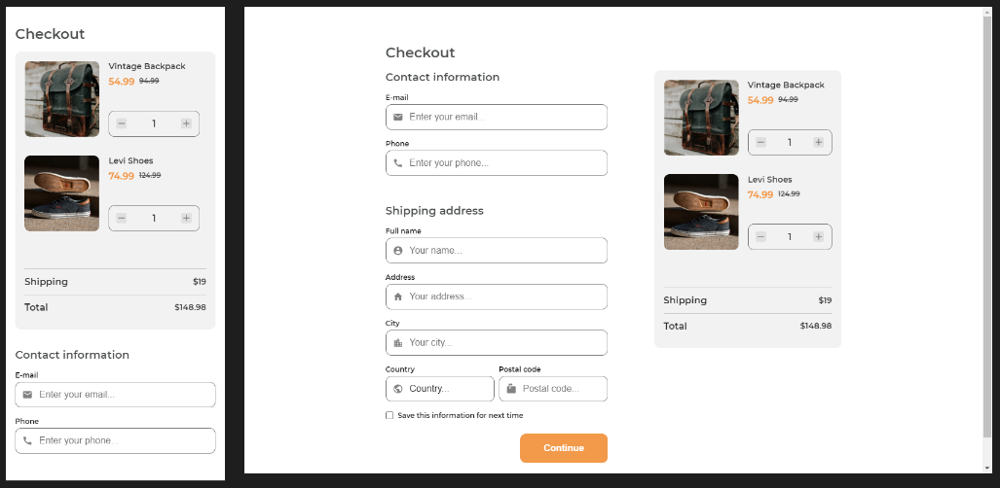

## Checkout Page Challenge

Live version of a project can be found [here](https://objective-davinci-e4f803.netlify.app/checkoutpage/ "Checkout page live demo")

**Challenge:** Create a checkout page following the design. You don’t need to use JS in this challenge but use correct input types and validation. Don’t look at the existing solution. Fulfill user stories below:

- **User story:** I can see a page following the given design
- **User story:** I can input email, phone, full name, address, city, country, and postal code
- **User story:** I can input the number of items
- **User story:** I can select at least 3 countries from the dropdown
- **User story:** When I click submit button or press enter, I can see a warning if validation fails
- **User story:** When I click submit button or press enter, I can see a successful alert if validation succeeds

**Practiced:** I've used Flexbox for layout and JavaScript for validation

