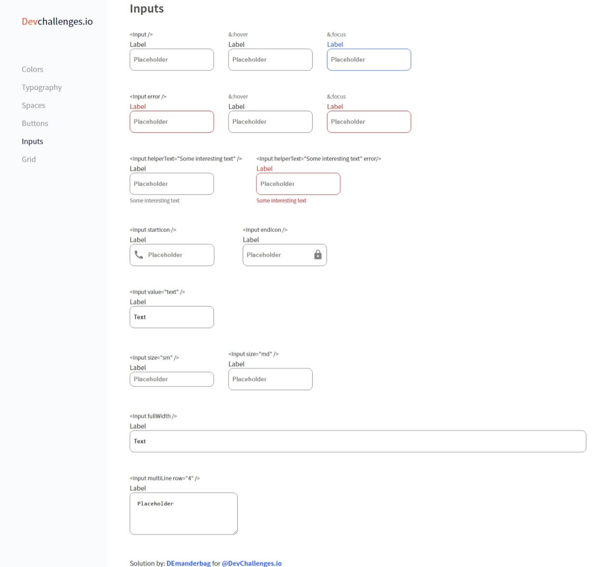

## Design System Input Challenge

Live version of a project can be found [here](https://objective-davinci-e4f803.netlify.app/designsystem-input/ "Design System Input live demo")

**Challenge:** Create a reusable input with all the states in the design and a page displaying all the states. You can work on the same project with other *`design system`* challenges. Use Front-end libraries like React or Vue. Don’t look at the existing solution. Fulfill user stories below:

- **User story:** I can see error state
- **User story:** I can choose to disable input
- **User story:** I can choose to have helper text
- **User story:** I can choose to have an icon on the left or right (Use Google Icon and at least 5 variants)
- **User story:**: I can have different input sizes
- **User story:** I can have different colors
- **User story:** I can choose to have input take the width of the parent
- **User story:** I can have multiline input like a _`textarea`_
- **User story:** When I hover or focus, I can see visual indicators
- **User story:** I can still access all input attributes

**Practiced:** In this project I was practicing BEM methodology

