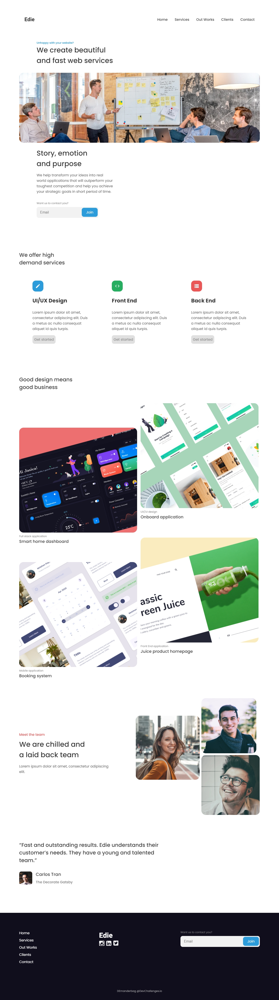

## Interior Consultant Challenge

Live version of a project can be found [here](https://objective-davinci-e4f803.netlify.app/ediehomepage/)

**Challenge:** Create a static page with HTML and CSS following the designs. Don’t look at the existing solution. Fulfill user stories below:

- **User story:** I can see a page following the given design
- **User story:** I can see a page on mobile following the given design
- **User story:** I can go to certain locations by selecting links in navigation or footer

**Practiced:** While creating this responsive design I've used Flexbox and used JavaScript for navigation. Practiced BEM methodology as well.

