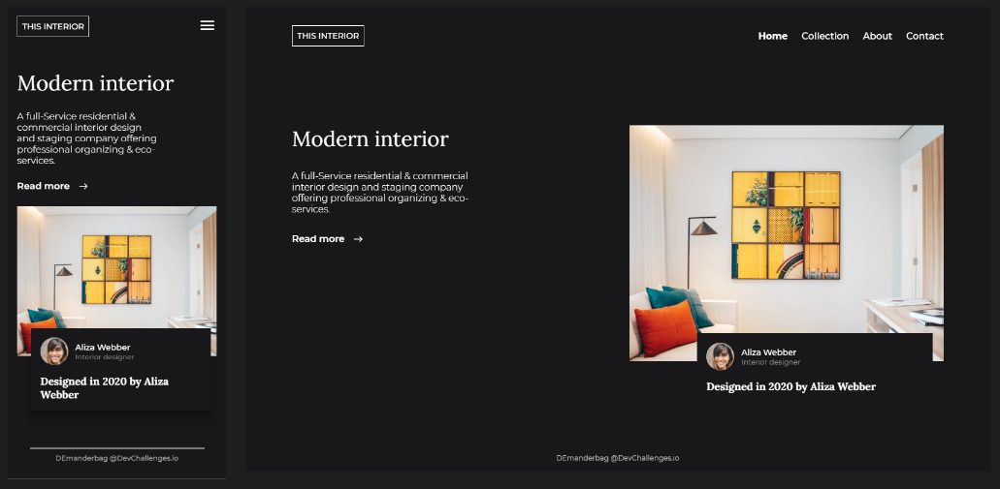

## Interior Consultant Challenge

Live version of a project can be found [here](https://objective-davinci-e4f803.netlify.app/interiorconsultant/ "InteriorC")

**Challenge:** Create a homepage following the design. The page should be responsive. Don’t look at the existing solution. Fulfill user stories below:

- **User story:** I can see a page following the given design
- **User story:** On mobile, I can see a collapsed navigation
- **User story:** On mobile, when I select the hamburger menu, I can see a navigation

**Practiced:** While creating this responsive design I've used Flexbox and used JavaScript for navigation. Practiced BEM methodology as well.

