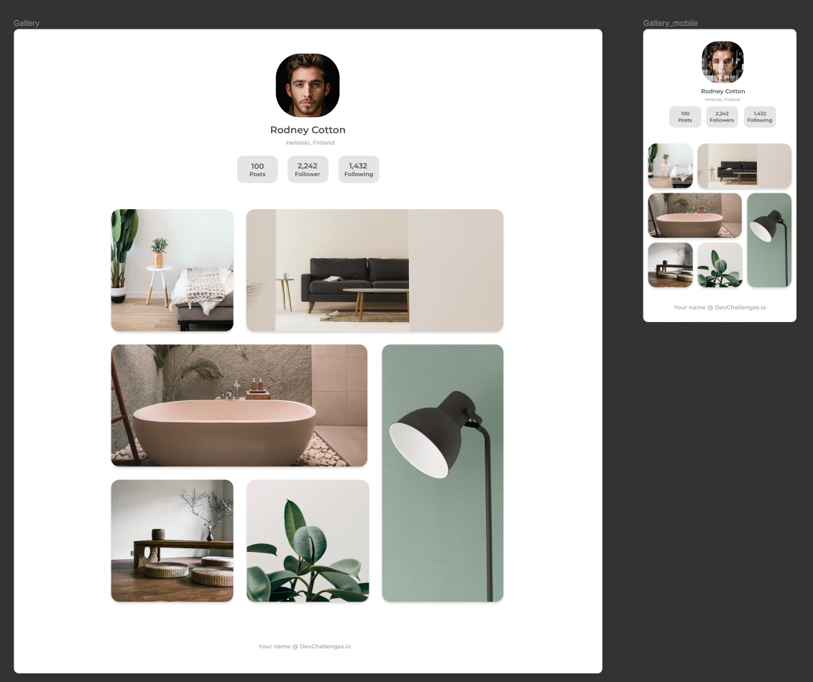

## My Gallery Challenge

Live version of a project can be found [here](https://mygallery.demanderbag.vercel.app/ "My Gallery live demo")

**Challenge:** Create a static page with HTML and CSS following the designs. You can give it your personal styles by using different images or text. Don’t look at the existing solution. Fulfill user stories below

- **User story:** I can see a page following the given design

**Practiced:** In this project I was practicing mobile first approach for this web design while using Flexbox and CSS Grid as well as BEM methodology.

