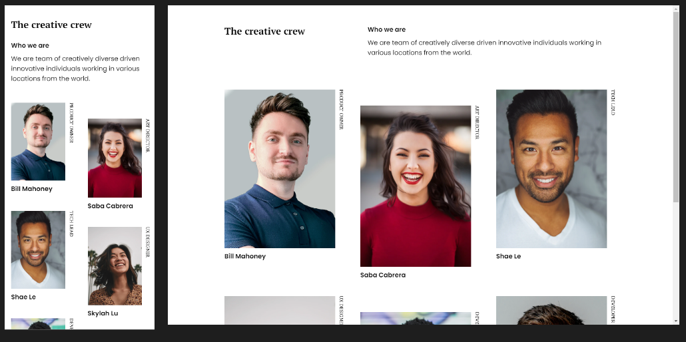

## My team page Challenge

Live version of a project can be found [here](https://objective-davinci-e4f803.netlify.app/myteampage/ "My Gallery live demo")

**Challenge:** Challenge: Create my team page following the design. The page should be responsive. Don’t look at the existing solution. Fulfill user stories below

- **User story:** I can see a page following the given design

**Practiced:** I've recreated this design by using primarily Flexbox and CSS Grid as well as BEM methodology.

