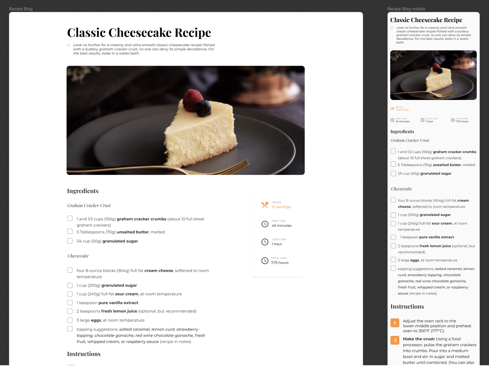

## Recipe Page Challenge

Live version of a project can be found [here](https://recipe-blog.vercel.app/ "Recipe Page live demo")

**Challenge:** Create a recipe page following the given design. You can use your own recipe and remember to put the source. The page should be responsive. Don’t look at existing solution. Fulfill user stories below:

- **User story:** I can see a recipe with ingredients and instructions
- **User story:** I can select a checkbox if I have the ingredients
- **User story:** I can see number of servings, baking times

**Practiced:** In this project I was practicing mobile first approach for this web design while using Flexbox

