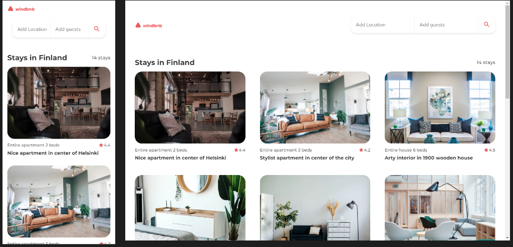

## Windbnb

A live version of a project can be found [here](https://objective-davinci-e4f803.netlify.app/windbnb/ "Windbnb Page live demo")

**Challenge:** Create a small version of Airbnb - Windbnb with given data. Use Front-end libraries like React or Vue. Don’t look at the existing solution. Fulfill user stories below:

- **User story:** I can see a list of properties
- **User story:** I can see property card with a name, rating, apartment type, and super host
- **User story:** I can open filter drawer
- **User story:** I can filter properties by location and number of guests (guest filter search not implemented)
- **User story:** I can see the number of filtered items
- **User story:** I can see pages following given designs

**Practised:** In this project, I was practising mobile-first approach while using Flexbox and CSS Grid for displaying content. Content is loaded from JavaScript with an ability to filter the content by city.

