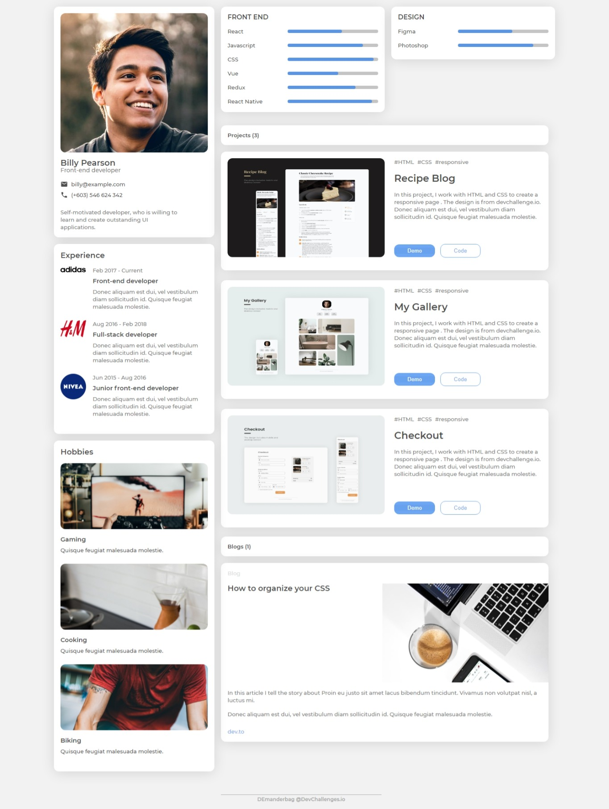

## Portfolio Challenge

Live version of a project can be found [here](https://objective-davinci-e4f803.netlify.app/portfolio/index.html)

**Challenge:** Create all the elements in the given designs and then create a portfolio with your own content. You can create your own layout. You can use React, Vue.js, or other libraries to create a reusable component, but it is not required. Don’t look at the existing solution. Fulfill user stories below:

- **User story:** I can see personal details
- **User story:** I can see skills
- **User story:** I can see projects
- **User story:** I can see hobbies or certificates
- **User story:** I can see experiences
- **User story:** I can see blogs

**Practiced:** While creating this responsive design I've used Flexbox with a basic CSS Grid, I was using BEM methodology for this project.

