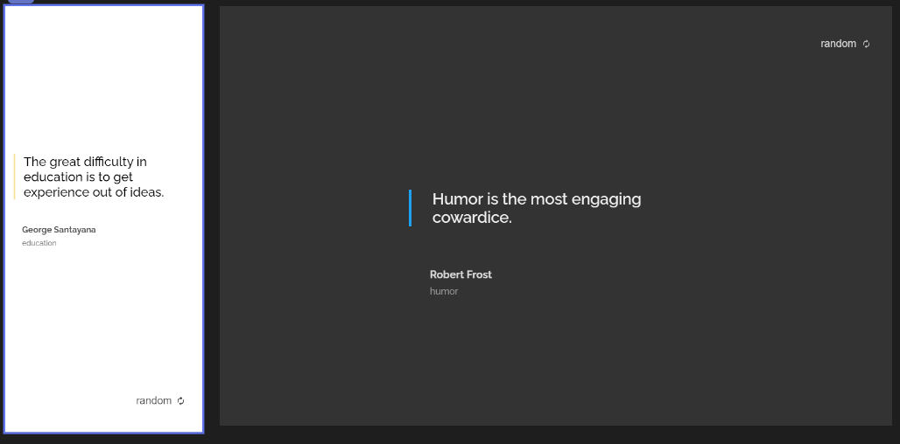

## Random Quote Generator

A live version of a project can be found [here](https://objective-davinci-e4f803.netlify.app/quotegenerator/ "Random Quote generator live demo")

**Challenge:** Create a quote generator app. Don’t look at the existing solution. Fulfill user stories below:

- **User story:** I can see a random quote
- **User story:** I generate a new random quote
- **User story:** When I select quote author, I can see a list of quotes from them
- **User story:** I can see quote genre under the author

**API: [https://pprathameshmore.github.io/QuoteGarden/](https://github.com/pprathameshmore/QuoteGarden/blob/master/README.md)**

**How was this project created?** In this project I've used external API to make a request and generate the data which was loaded from JavaScript. Flexbox was used for layout. This project also supports dark mode with _prefers-color-scheme_ media query.

