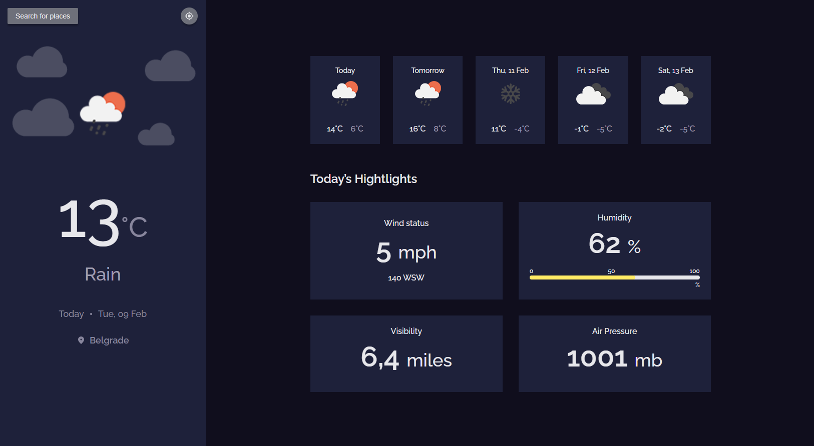

## Weather app

A live version of a project can be found [here](https://www.heydusan.com/weatherapp/ "Weather app live demo")

**Challenge:** Create a weather app using an API. Don’t look at the existing solution. Fulfill user stories below:

- **User story:** I can see city weather as default, preferably my current location
- **User story:** I can search for city
- **User story:** I can see weather of today and the next 5 days
- **User story:** I can see the date and location of the weather
- **User story:** I can see according to image for each type of weather
- **User story:** I can see the min and max degree each day
- **User story:** I can see wind status and wind direction
- **User story:** I can see humidity percentage
- **User story:** I can see visibility indicator
- **User story:** I can see air pressure number
- **User story:** I can request my current location weather
- **User story:** I can convert temperature in Celcius to Fahrenheit and vice versa

**API: [https://openweathermap.org/api](https://openweathermap.org/api)**

**How was this project created?** In this project I've used external API to make a request and generate the data which was loaded from JavaScript. Flexbox and CSS Grid were used for layout.

